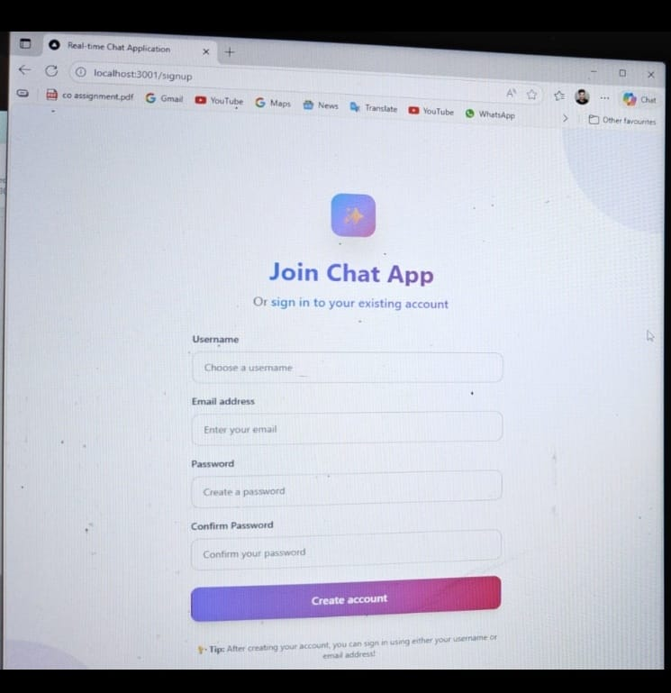
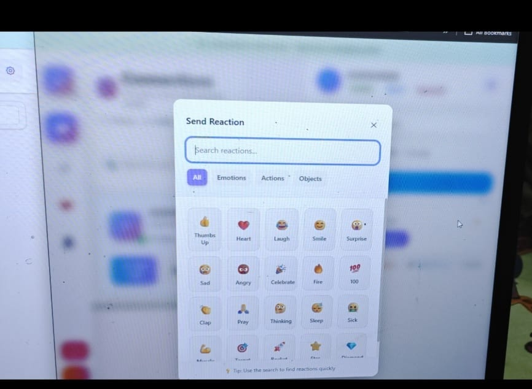

# Real-Time Chat Application

Modern chat UI built with **Next.js 15**, **React 19**, **TypeScript**, **Socket.io**, and **MongoDB**. It ships multi-device messaging, reactions, profile management, and a colorful Tailwind-driven interface.

---

## 🌟 Highlights
- **Secure auth** — Email/username flows backed by JWT+bcrypt.
- **Realtime messaging** — Socket.io delivery receipts, reactions, and delete-for-everyone controls.
- **People & sessions** — Favorites, presence, profile editing, remote session revocation.
- **Polished UI** — Tailwind v4 gradients, modern layouts, works across browsers/devices.

## ✨ Features
- Real-time 1:1 chat with synchronized dual-pane view and delivery receipts.
- Emoji catalog, quick reactions, and inline reaction management.
- Message tools: keyword search, delete for me/everyone, and clear-thread actions.
- Contact utilities: favorites, detailed profile panels, and online/offline indicators.
- Session management: track or revoke active devices, view socket health, and monitor status.
- Auth flows with signup/login, JWT middleware, and multi-device persistence.

---

## 🧰 Tech Stack
| Layer | Technologies |
| --- | --- |
| UI framework | Next.js 15 App Router, React 19, TypeScript 5 |
| Styling | Tailwind CSS v4, custom CSS modules, PostCSS |
| Real-time transport | Socket.io 4 (client + Node server) |
| Data & auth | MongoDB Atlas with Mongoose 8, JWT, bcryptjs |
| Tooling | Node.js 20+, npm 10+, ESLint 9, Turbopack/Next build |
| Dev scripts | `dev`, `dev:socket`, `dev:all`, setup wizard, cleanup utilities |

---

## 🏗 Architecture Overview
- **App Router UI**: `app/` renders pages + API routes.
- **Socket hub**: `server.js` handles WebSocket traffic off the Next.js process.
- **MongoDB via Mongoose**: central models live in `lib/` + `models/` and are reused by APIs, sockets, and scripts.
- **Middleware**: JWT verification guards protected routes.

```
Browser ↔ Next.js (app/) ↔ API Routes ↔ MongoDB
        ↘ Socket.io Client ↔ server.js ↔ MongoDB
```

---

## 📁 Project Structure

```
Real-Time-Chat-Application/
├── app/
│   ├── components/ (Chat, Sidebar, ReactionBar…)
│   ├── login/, signup/ (Auth pages)
│   └── api/ (auth, messages, users, socket, health routes)
├── lib/ (env helpers, Mongo + socket clients)
├── models/ (User & Message schemas in TS/CJS)
├── public/
│   └── screenshots/*.jpg (README gallery + UI assets)
├── scripts/ (cleanup utilities)
├── server.js (Socket.io service)
├── middleware.ts (JWT gate)
└── clean-database.js · setup-env.js · package.json
```

---

## ✅ Prerequisites
- Node.js 20+
- npm 10+
- MongoDB Atlas (or any reachable Mongo instance)

---

## 🚀 Getting Started

```bash
git clone https://github.com/Subhajyoti-Maity/Real-Time-Chat-Application.git
cd Real-Time-Chat-Application
npm install
npm run setup   # guides you through .env.local
```

Manual `.env.local` fallback (never commit this file):

```env
MONGODB_URI="mongodb+srv://<USER>:<PASSWORD>@cluster/chat_app"
JWT_SECRET="replace_me" # use a long random string in real deployments
SOCKET_PORT=3006
NEXT_PUBLIC_SOCKET_PORT=3006
```

---

## 🧪 Running Locally
Run both processes during development:

```bash
npm run dev        # Next.js UI + API (defaults to http://localhost:3001)
npm run dev:socket # Socket server (http://localhost:3006)
```

Create two demo accounts via `/signup`, log in on different browsers, and chat instantly.

---

## 🖼 Demo Clips (Quick Tour)
Add more **JPEG**s under `public/screenshots/` and drop new rows in this compact gallery.

| View | Preview | Focus |
| --- | --- | --- |
| Sign-in |  | Username/email login with gradient CTA + session reminder. |
| Create account |  | Onboarding with helper copy and password confirmation. |
| Dual chat |  | Sender/receiver panes proving live sync in both directions. |
| Quick actions |  | Contact action sheet for view profile, clear chat, archive, etc. |
| Reactions |  | Emoji picker + inline chips for immediate feedback. |
| Search |  | Keyword search while composing so context never leaves. |
| Dashboard |  | Post-login overview with presence, favorites, and socket status. |

> If an image fails to render, double-check the filename/extension inside `public/screenshots/`.

---

## 🔧 Available Scripts
| Command | Purpose |
| --- | --- |
| `npm run setup` | Generate `.env.local` interactively. |
| `npm run dev` | Next.js dev server (frontend + APIs). |
| `npm run dev:socket` | Standalone Socket.io server on `SOCKET_PORT`. |
| `npm run build` | Production build via Next.js/Turbopack. |
| `npm run start` | Run the compiled app (requires `npm run build`). |
| `npm run lint` | ESLint checks. |
| `node scripts/remove-users.js` | Delete seeded or test users + their messages. |
| `node clean-database.js` | Full DB cleanup (use with caution). |

---

## 📡 API Surface (selected)
| Endpoint | Method | Purpose |
| --- | --- | --- |
| `/api/auth/signup` | POST | Create a new user + initial session. |
| `/api/auth/login` | POST | Authenticate and issue JWT + refresh session list. |
| `/api/users/profile` | PUT | Update profile metadata. |
| `/api/users/search` | GET | Find other users to connect with. |
| `/api/users/sessions` | GET/DELETE | Inspect or revoke active sessions. |
| `/api/users/favorites` | GET/POST/DELETE | Manage favorite contacts. |
| `/api/messages` | GET/POST | Fetch or send chat messages. |
| `/api/messages/[id]/me` | DELETE | Delete message for the requesting user. |
| `/api/messages/[id]/everyone` | DELETE | Delete message globally. |
| `/api/socket-status` | GET | Check websocket health from the UI. |

---

## 🛠 Troubleshooting
- **Cannot connect to MongoDB** → verify connection string / IP whitelist in Atlas.
- **Socket keeps disconnecting** → ensure `dev:socket` server is running; confirm ports aren’t blocked by firewalls.
- **JWT errors** → delete stale cookies/localStorage tokens and log in again.
- **Port already in use** → `npx kill-port 3001 3006` (adjust as needed).
- **Images missing in README** → confirm each referenced `.jpg` exists in `public/screenshots/`.

---

## 🤝 Contributing
1. Fork & branch (`git checkout -b feature/<idea>`).
2. Build + add tests where it makes sense.
3. Run `npm run lint`, `npm run dev`, and `npm run dev:socket` to ensure clean output.
4. Submit a PR with a short summary + setup notes.

---

## ✍️ Author
- Subhajyoti Maity -
---

## 📄 License
This project is released under the MIT License. See `LICENSE` (add one if it does not yet exist).
in